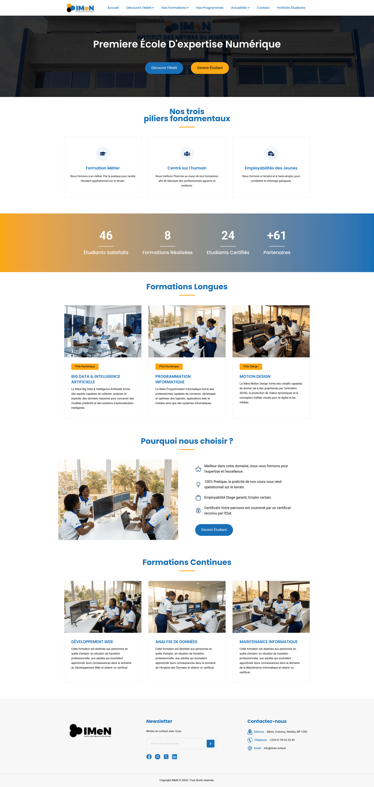
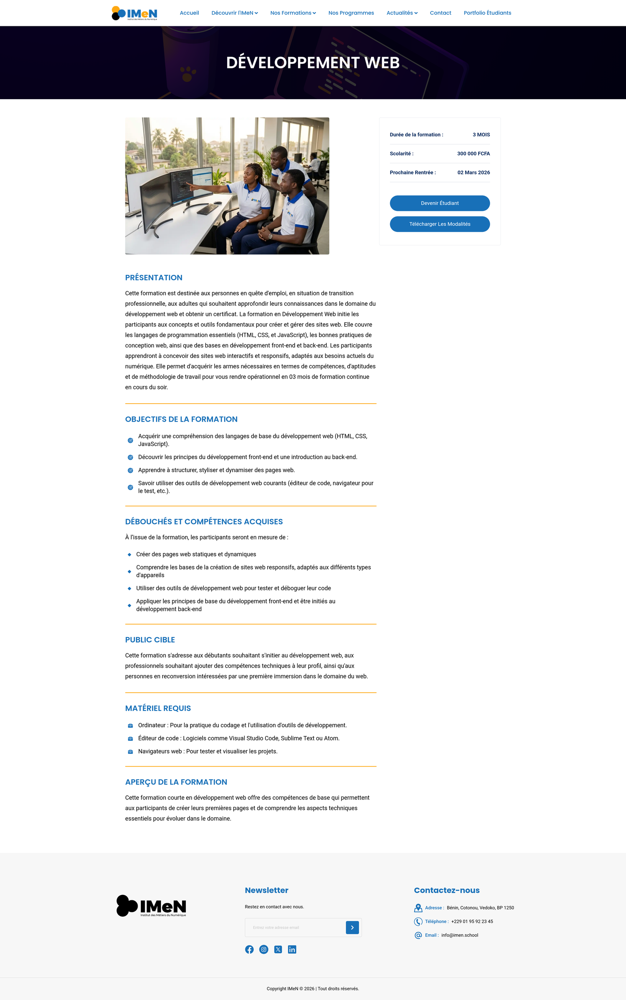
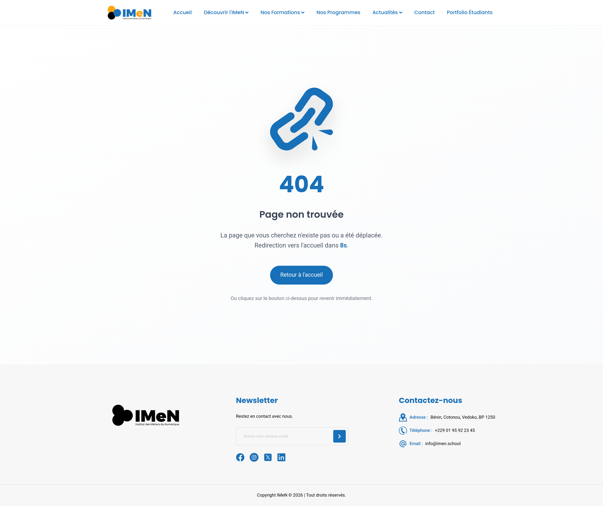
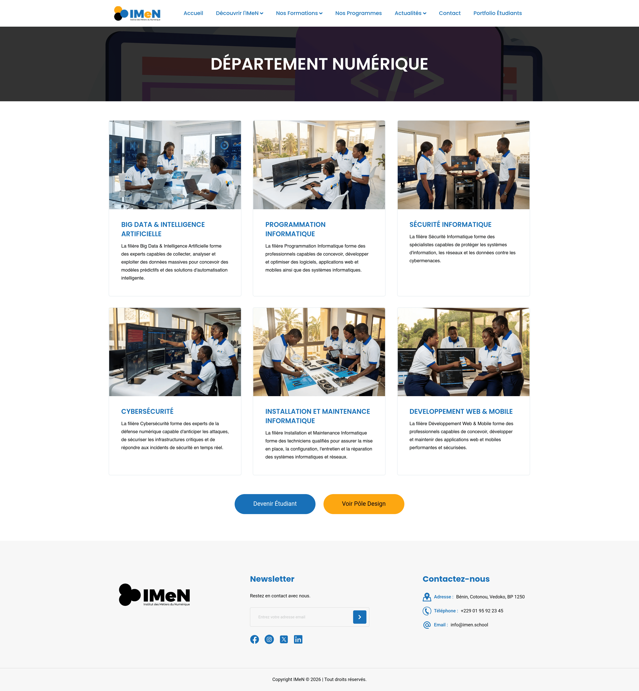
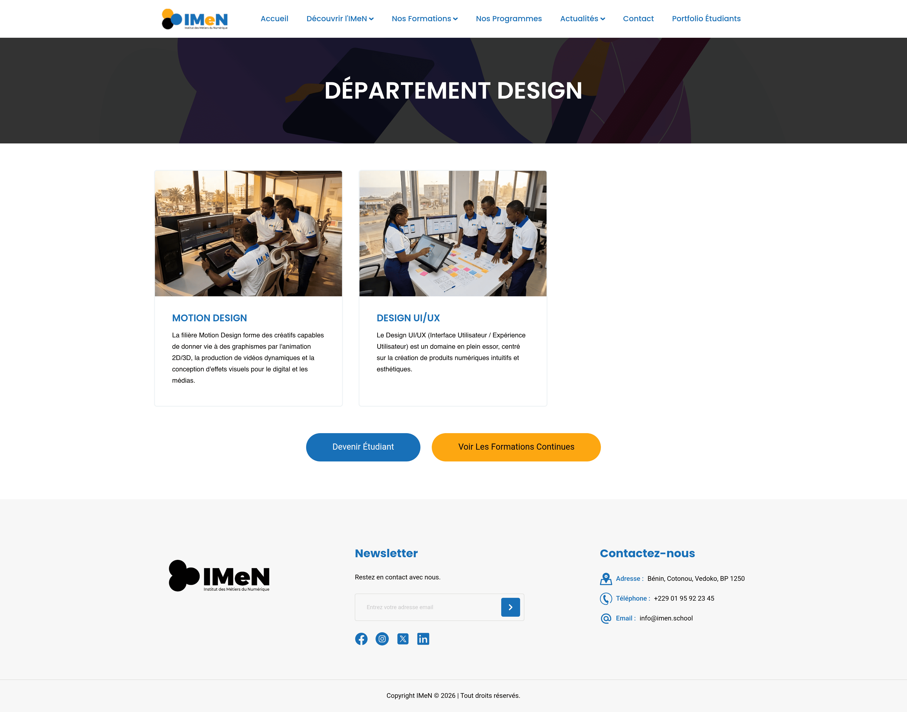
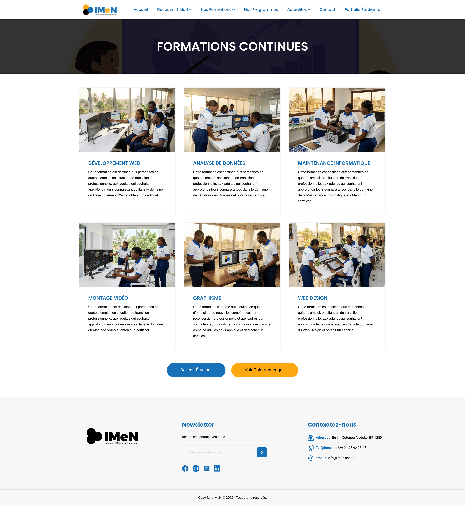

# IMeN Clone

<div align="center">

[](https://react.dev)
[](https://tailwindcss.com)
[](https://vite.dev)
[](https://github.com/fhermas22/imen-clone)
[](https://vercel.com)
[](LICENSE)

</div>

> A modern clone of the **Institut des Métiers du Numérique (IMeN)** website, built with React, Vite, and Tailwind CSS v4. This project replicates the professional look and feel of the original IMeN website with fully responsive design and data-driven sections, serving as a learning exercise in modern frontend development.

## ✨ Features

- **Responsive Header & Navigation** — Header with Navbar featuring mobile hamburger menu, scroll-aware styling (backdrop blur + shadow), and NavItemDropdown support
- **Hero Section** — Immersive hero with IMeN building photo and primary/secondary CTA buttons
- **Fundamental Pillars** — 3 PillarCards with hover icons (Formation Métier, Centré Humain, Employabilité)
- **Animated Stats** — StatsCounter for 72+ students, 16 formations, 39 certifiés, +100 partners
- **Long-term Formations** — 8 TrainingCards across Digital and Design departments (Programmation Informatique, Motion Design, Big Data & IA, Cybersécurité, etc.)
- **Why Choose Us** — ValuePoint list (4 points) with illustration and CTA
- **Continuing Education** — 6 TrainingCards (Développement Web, Analyse de Données, Maintenance Informatique, Montage Vidéo, Graphisme, Web Design)
- **Department Pages** — Dynamic `/department/:dept` routes (Numérique, Design, Continuing Education) with hero illustrations and filtered training grids
- **Training Detail Page** — `/training/:id` route with TrainingDetail, BoxDetail components, and downloadable payment terms
- **Reusable Error Component** — Configurable ErrorNotFound component with auto-redirect countdown for 404 scenarios
- **Footer & Social Links** — Responsive Footer with SocialLink components (Facebook, Instagram, Twitter/X, LinkedIn)
- **Component-Based & Data-Driven** — Reusable UI components driven by `src/datas/` (pillarList.js, trainingList.js, valuePointList.js)
- **ScrollToTop Utility** — Smooth scrolling on page navigation
- **Client-Side Routing** — React Router DOM with BrowserRouter
- **Dynamic Routing** — Department and Training pages render content dynamically via `useParams` based on route IDs, reducing duplication
- **404 Error Page** — Custom responsive 404 page with automatic countdown redirect
- **SPA Redirects** — `public/_redirects` configured for client-side routing on static hosts

## 🛠️ Tech Stack

| Technology | Version | Description |
|------------|---------|-------------|
| React | 19.2.0 | Core UI framework with StrictMode |
| Vite | 7.3.1 | Fast build tool and dev server |
| Tailwind CSS | 4.1.18 (@tailwindcss/vite) | Utility-first CSS with Vite plugin |
| React Router DOM | 7.13.1 | BrowserRouter for SPA routing |
| ESLint | 9.39.3 (flat config) | Modern linting configuration |

## 📋 Prerequisites

- **Node.js** v18+
- **npm** or **yarn**

## 🚀 Getting Started

### 1. Clone

```bash
git clone https://github.com/fhermas22/imen-clone.git
cd imen-clone
```

### 2. Install

```bash
npm install
```

### 3. Dev Server

```bash
npm run dev
```

Open http://localhost:5173 (or assigned port).

### 4. Build & Preview

```bash
npm run build
npm run preview
```

## 📁 Project Structure

```
imen-clone/
├── public/
│   ├── _redirects                    # SPA redirect rules for static hosts
│   └── favicon.ico
├── src/
│   ├── assets/
│   │   ├── documents/                # Payment terms and other documents
│   │   ├── images/
│   │   │   ├── icons/                # SVG icons (primary/secondary/blue/white variants)
│   │   │   ├── illustrations/
│   │   │   │   ├── other/            # our-students.webp
│   │   │   │   ├── trainings/
│   │   │   │   │   ├── continuing.education/     # 6 training images + hero
│   │   │   │   │   └── long.term.training/       # 8 training images + hero (digital/design)
│   │   │   ├── logo/                 # imen_logo.png, imen_logo_dark.png
│   │   │   ├── photos/               # imen-building.webp, it-programming-students.webp
│   │   │   └── screenshots/          # Page screenshots for documentation
│   │   └── screenshots/
│   ├── components/
│   │   ├── common/
│   │   │   ├── Button/
│   │   │   └── ErrorNotFound/        # Reusable 404 component with countdown redirect
│   │   ├── layout/
│   │   │   ├── Footer/
│   │   │   │   └── components/
│   │   │   │       └── SocialLink/
│   │   │   └── Header/
│   │   │       └── components/
│   │   │           ├── Navbar/       # Mobile hamburger + scroll-aware nav
│   │   │           └── NavItemDropdown/
│   │   └── ui/
│   │       ├── BoxDetail/            # Training metadata sidebar component
│   │       ├── PillarCard/
│   │       ├── SectionTitle/
│   │       ├── StatsCounter/
│   │       ├── TrainingCard/
│   │       ├── TrainingDetail/
│   │       └── ValuePoint/
│   ├── datas/
│   │   ├── pillarList.js             # 3 pillars data
│   │   ├── trainingList.js           # All trainings (8 long-term + 6 continuing)
│   │   └── valuePointList.js         # 4 value points
│   ├── pages/
│   │   ├── Department/               # Dynamic department listing page
│   │   ├── Error/                    # 404 error page
│   │   ├── Home/                     # Landing page with 6 sections
│   │   └── Training/                 # Dynamic training detail page
│   ├── utils/
│   │   ├── hooks/
│   │   ├── scripts/
│   │   │   └── ScrollToTop.jsx
│   │   └── style/
│   │       └── app.css
│   └── main.jsx                      # App entry + Router setup
├── index.html
├── package.json
├── vite.config.js
├── eslint.config.js
└── vercel.json
```

## 🎨 Scripts

| Command | Description |
|---------|-------------|
| `npm run dev` | Dev server |
| `npm run build` | Production build |
| `npm run preview` | Preview build |
| `npm run lint` | Lint code |

## 🚀 Deployment (Vercel)

1. Install Vercel CLI: `npm i -g vercel`
2. `vercel` (follow prompts)
3. Or push to GitHub + Vercel dashboard.

Configures SPA rewrites + asset caching.

## 📸 Screenshots

| | | |
|:---:|:---:|:---:|
| **Home Page** | **Training Detail Page** | **404 Error Page** |
|  |  |  |
| **Digital Department** | **Design Department** | **Continuing Education** |
|  |  |  |

## 📝 Changelog

### Version 0.6.12 (Current)
- ✅ Added Department pages (`/department/:dept`) with dynamic routing for Numérique, Design, and Continuing Education
- ✅ Created reusable `ErrorNotFound` component with configurable auto-redirect countdown
- ✅ Added `BoxDetail` UI component for training metadata side-panel
- ✅ Expanded training catalog to **14 programs** (8 long-term + 6 continuing education) with detailed fields (presentation, goals, openings, target audience, materials, preview)
- ✅ Implemented mobile-responsive navbar with hamburger menu and scroll-aware backdrop blur styling
- ✅ Added `public/_redirects` for SPA routing support on static hosts
- ✅ Added screenshots for Digital Department, Design Department, and Continuing Education pages
- ✅ Synced version to package.json 0.6.12

### Version 0.3.12
- ✅ Implemented dynamic routing for Training page using useParams (route ID-based templates)
- ✅ Added 404 Error page (`src/pages/Error/index.jsx`)
- ✅ Added screenshots for training_page and 404_page
- ✅ Synced version to package.json 0.3.12

### Version 0.2.11
- ✅ Added Training page (`/training`) with responsive listing
- ✅ New TrainingDetail and BoxDetail UI components
- ✅ trainingList.js data (consolidated long-term + continuing education)
- ✅ ScrollToTop.jsx utility for smooth navigation
- ✅ Updated project structure and datas/

### Version 0.0.7
- ✅ Full Home page with 6 data-driven sections
- ✅ Added NavItemDropdown component
- ✅ Initial datas/ setup
- ✅ Tailwind CSS v4 with @tailwindcss/vite plugin
- ✅ vercel.json for deployment
- ✅ eslint.config.js flat config
- ✅ All Home UI components implemented & responsive

## 🤝 Contributing

1. Fork & branch: `git checkout -b feature/xyz`
2. Lint: `npm run lint`
3. Commit: `git commit -m '...'`
4. PR

## 📄 License

Educational clone. Original © IMeN (https://imen.school)

---

<div align="center">

✨ **Built by [@fhermas22](https://github.com/fhermas22)** ✨

</div>

